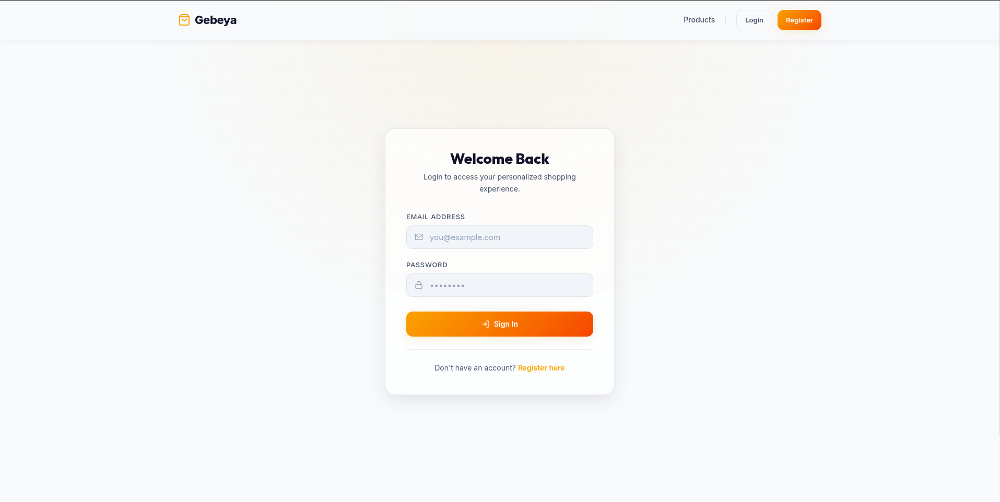
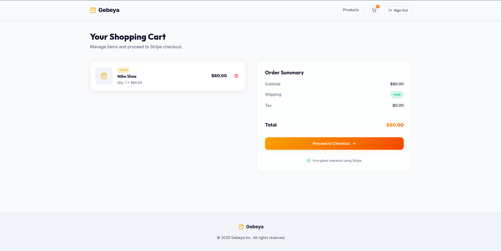
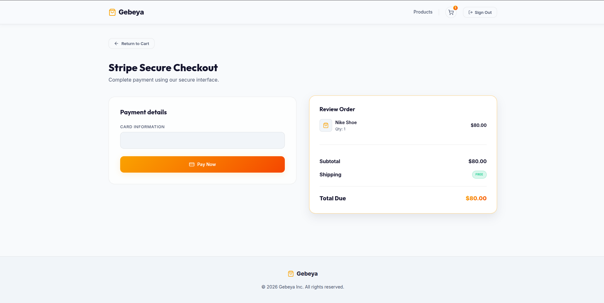
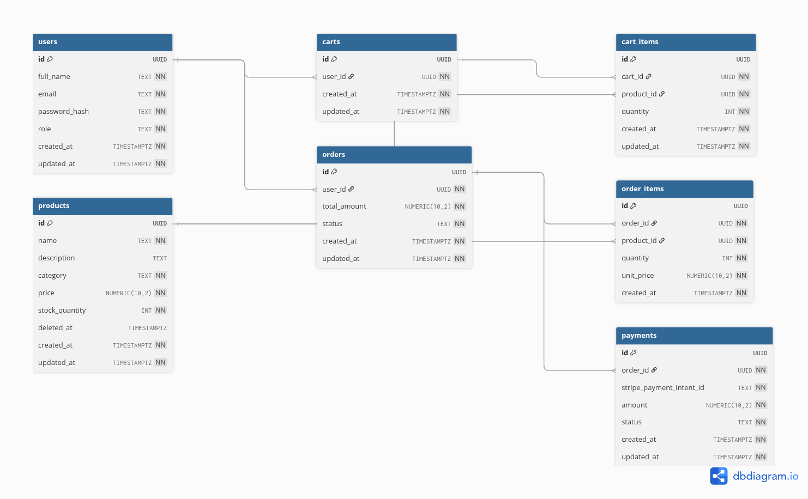

#  Ecommerce API

A production-ready RESTful ecommerce API built with **Go**, **PostgreSQL**, and **Stripe**. Designed with clean architecture principles — fully containerized with Docker and ready to deploy.

<br/>

## Features

- **JWT Authentication** — secure register and login with bcrypt password hashing
- **Role-based Access Control** — customer and admin roles with middleware protection
- **Product Management** — full CRUD with soft delete and category filtering
- **Cart System** — per-user cart with upsert on duplicate items
- **Order Processing** — checkout flow with order and order item snapshots
- **Stripe Payments** — PaymentIntent creation and webhook handling
- **Clean Architecture** — handler → service → repository, fully separated layers
- **Docker Ready** — single command to spin up the entire stack
- **React Frontend** — modern light-mode UI with golden brand theme

<br/>

## UI Screenshots

<div align="center">
  
  
  <br/><br/>
  
  
</div>

<br/>

## Database Schema



**7 tables:** `users`, `products`, `carts`, `cart_items`, `orders`, `order_items`, `payments`

Key design decisions:
- UUIDs generated by PostgreSQL via `gen_random_uuid()`
- Products use **soft delete** (`deleted_at`) — order history always stays accurate
- `order_items` stores `unit_price` at checkout time — price changes never affect past orders
- `cart_items` uses `ON CONFLICT DO UPDATE` — adding an existing product increments quantity instead of duplicating
- `TIMESTAMPTZ` used throughout for timezone-safe timestamps

<br/>

## Project Structure

```
ecommerce-api/
├── cmd/api/
│   └── main.go                   # Entry point — wires all layers together
├── internal/
│   ├── db/
│   │   └── db.go                 # Database connection pool
│   ├── domain/                   # Structs, repository interfaces, service interfaces
│   │   ├── user.go
│   │   ├── product.go
│   │   ├── cart.go
│   │   ├── order.go
│   │   ├── payment.go
│   │   └── error.go
│   ├── repository/               # Raw SQL queries — no ORM
│   │   ├── user_repo.go
│   │   ├── product_repo.go
│   │   ├── cart_repo.go
│   │   ├── order_repo.go
│   │   └── payment_repo.go
│   ├── service/                  # Business logic
│   │   ├── auth_service.go
│   │   ├── product_service.go
│   │   ├── cart_service.go
│   │   ├── order_service.go
│   │   └── payment_service.go
│   ├── handler/                  # HTTP handlers — Gin
│   │   |── login__handler.go
|   |   |── register_handler.go
|   |   ├── auth_handler.go
│   │   ├── product_handler.go
│   │   ├── cart_handler.go
│   │   ├── order_handler.go
│   │   └── payment_handler.go
│   └── routes/
│       └── routes.go             # Route definitions with middleware groups
├── migrations/
│   └── 001_initial_schema.sql    # Database schema
├── pkg/
│   ├── middleware/
│   │   ├── auth.go               # JWT validation middleware
│   │   └── admin.go              # Admin role middleware
│   └── response/
│       └── json.go               # Shared JSON response helpers
├── assets/
│   └── schema.png                # Database schema diagram
├── Dockerfile
├── docker-compose.yml
├── .env.example
└── go.mod
```

<br/>

## Getting Started

### Prerequisites

- [Docker](https://docs.docker.com/get-docker/)
- [Stripe CLI](https://stripe.com/docs/stripe-cli) (for webhook testing)

### 1. Clone the repository

```bash
git clone https://github.com/kidus-yoseph1/ecommerce-api.git
cd ecommerce-api
```

### 2. Configure environment variables

```bash
cp .env.example .env
```

Fill in your `.env`:

```env
PORT=8080

DB_HOST=db
DB_PORT=5432
DB_USER=postgres
DB_PASSWORD=password
DB_NAME=ecommerce

JWT_SECRET=your-super-secret-key

STRIPE_SECRET_KEY=sk_test_...
STRIPE_WEBHOOK_SECRET=whsec_...
```

### 3. Start the entire stack

```bash
docker compose up --build
```

This starts both the API and PostgreSQL, runs migrations automatically, and the API is ready at `http://localhost:8080`.

<br/>

##  API Endpoints

### Auth
| Method | Endpoint | Auth | Description |
|--------|----------|------|-------------|
| `POST` | `/auth/register` | Public | Register a new account |
| `POST` | `/auth/login` | Public | Login and receive JWT token |

### Products
| Method | Endpoint | Auth | Description |
|--------|----------|------|-------------|
| `GET` | `/products` | Public | List all products — optional `?category=` filter |
| `GET` | `/products/:id` | Public | Get product by ID |
| `POST` | `/products` | Admin | Create a product |
| `PUT` | `/products/:id` | Admin | Update a product |
| `DELETE` | `/products/:id` | Admin | Soft delete a product |

### Cart
| Method | Endpoint | Auth | Description |
|--------|----------|------|-------------|
| `POST` | `/cart` | Customer | Create cart |
| `GET` | `/cart` | Customer | Get current user's cart |
| `POST` | `/cart/items` | Customer | Add item to cart |
| `DELETE` | `/cart/items/:id` | Customer | Remove item from cart |

### Orders
| Method | Endpoint | Auth | Description |
|--------|----------|------|-------------|
| `POST` | `/checkout` | Customer | Checkout — creates order and Stripe PaymentIntent |
| `GET` | `/orders/:id` | Customer | Get order by ID |
| `GET` | `/orders/:id/items` | Customer | Get order items |

### Payments
| Method | Endpoint | Auth | Description |
|--------|----------|------|-------------|
| `POST` | `/webhooks/stripe` | Public | Stripe webhook handler |

<br/>

##  Authentication

All protected routes require a Bearer token in the `Authorization` header:

```
Authorization: Bearer <your-jwt-token>
```

Get your token from `POST /auth/login`.

Tokens expire after **24 hours**.

<br/>

##  Payment Flow

```
1.  Customer adds items to cart
2.  Customer hits POST /checkout
3.  API creates order (status: pending)
4.  API creates Stripe PaymentIntent
5.  API returns order_id + client_secret
6.  Client completes payment using client_secret via Stripe UI
7.  Stripe sends webhook to POST /webhooks/stripe
         ├── payment_intent.succeeded → order: paid, cart: cleared
         └── payment_intent.payment_failed → order: pending, cart: preserved
```

<br/>

##  Testing Webhooks Locally

```bash
# Terminal 1 — start the server
docker compose up

# Terminal 2 — forward Stripe events to your local server
stripe listen --forward-to localhost:8080/webhooks/stripe

# Terminal 3 — simulate a payment
stripe trigger payment_intent.succeeded
```

Copy the webhook secret printed by the Stripe CLI into your `.env` as `STRIPE_WEBHOOK_SECRET`.

<br/>

##  Creating an Admin User

Register normally, then update the role directly in the database:

```bash
docker exec -it ecommerce-pg psql -U postgres -d ecommerce -c \
  "UPDATE users SET role='admin' WHERE email='your@email.com';"
```

<br/>

##  Tech Stack

| Layer | Technology |
|-------|-----------|
| Language | Go 1.23 |
| HTTP Framework | Gin |
| Database | PostgreSQL 15 |
| Auth | JWT (golang-jwt/jwt v5) |
| Password Hashing | bcrypt |
| Payments | Stripe Go SDK |
| Containerization | Docker + Docker Compose |

<br/>
